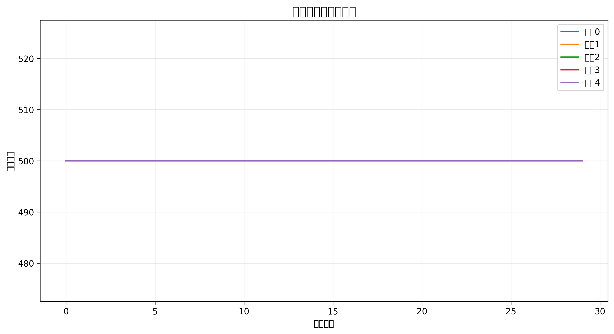

# Civilization Evolution Simulation System / 文明演化模拟系统

<div align="center">
  
</div>

## Project Overview / 项目简介

**English**: The Civilization Evolution Simulation System is a multi-agent based simulation platform designed to simulate the competition and development of multiple civilizations in a resource-limited environment. The system combines artificial intelligence, complex systems theory, and game theory to drive civilizations to make strategic choices through algorithms, achieving multi-dimensional civilization evolution including technology research and development, resource acquisition, territorial expansion, and diplomatic relations.

**中文**: 文明演化模拟系统是一个基于多智能体的演化模拟平台，旨在模拟多个文明在资源有限的环境中的竞争与发展过程。系统结合了人工智能、复杂系统理论和博弈论，通过算法驱动各文明做出策略选择，实现科技研发、资源获取、领土扩张和外交关系等多维度的文明演化。

## System Features / 系统特点

- **Multi-Agent Interaction / 多智能体交互**: Simulate multiple independent decision-making civilization agents
- **Complete Technology Tree System / 完整的科技树系统**: Including basic, intermediate, and advanced technologies
- **Complex Strategy Decision-Making / 复杂策略决策**: Dynamically adjust strategies based on resources, military, technology, and diplomatic factors
- **Territory and Resource Management / 领土与资源管理**: Simulate uneven resource distribution and territorial expansion mechanisms
- **Civilization Relationship Network / 文明关系网络**: Establishment and evolution of ally and enemy relationships
- **Rich Visualization Output / 丰富的可视化输出**: Heatmaps, evolution curves, radar charts, and various other charts
- **Complete Data Export / 完整的数据导出**: Support for CSV, JSON, and binary formats
- **Command-Line Interface / 命令行交互界面**: Provides both interactive and batch processing modes
- **Random Events System / 随机事件系统**: Introduce uncertainty through natural disasters, technological breakthroughs, etc.
- **Extended Strategy Types / 扩展策略类型**: Support for diplomacy, culture, and religious strategies

## Directory Structure / 目录结构

```
├── multi_agent_simulation.py  # Core simulation system / 核心模拟系统
├── civilization_visualizer.py # Visualization tools / 可视化工具
├── tech_tree.py               # Technology tree system / 科技树系统
├── simulation_config.py       # Configuration file / 配置文件
├── demo_simulation.py         # Demo script / 演示脚本
├── simulation_cli.py          # Command-line interface / 命令行界面
├── test_system.py             # System test script / 系统测试脚本
├── requirements.txt           # Dependency list / 依赖包列表
├── run_simulation.bat         # Quick start script (Windows) / 快速启动脚本(Windows)
├── example_config.py          # Configuration example / 配置示例
├── random_events.py           # Random events system / 随机事件系统
├── gui_prototype.py           # GUI prototype / GUI原型
└── test_results/              # Test results directory / 测试结果目录
```

## Installation / 安装说明

### Requirements / 环境要求
- Python 3.8+ 
- PyTorch 2.0+ 
- NumPy 1.24+ 
- Matplotlib 3.7+ 
- Pandas 2.0+ 
- NetworkX 3.0+

### Installation Steps / 安装步骤

1. Clone or download the project code
2. Install dependencies:
```bash
pip install -r requirements.txt
```
3. (Optional) Create a virtual environment:
```bash
python -m venv venv
# Windows
source venv/Scripts/activate
# Linux/Mac
source venv/bin/activate
```

1. 克隆或下载项目代码
2. 安装依赖包：
```bash
pip install -r requirements.txt
```
3. (可选) 创建虚拟环境：
```bash
python -m venv venv
# Windows
source venv/Scripts/activate
# Linux/Mac
source venv/bin/activate
```

## Usage / 使用方法

### Quick Start / 快速开始

The easiest way to start is using the batch file:
- Windows users: Double-click `run_simulation.bat`

Or run the demo script directly through the command line:
```bash
python demo_simulation.py
```

### Command-Line Interface / 命令行界面

The system provides a feature-rich command-line interface that supports various parameter configurations:

```bash
# Basic usage
python simulation_cli.py --num-civs 5 --cycles 100 --grid-size 200

# Interactive mode
python simulation_cli.py --interactive

# Using custom configuration file
python simulation_cli.py --config example_config.py

# Fast mode (reduced logs and visualization)
python simulation_cli.py --fast-mode
```

### GUI Interface / 图形界面

A prototype GUI interface is provided in `gui_prototype.py`:
```bash
python gui_prototype.py
```

## Core System Functions / 系统核心功能

### 1. Civilization Agent / 文明智能体 (CivilizationAgent)

Each civilization has the following core attributes:
每个文明具有以下核心属性：
- Military strength (strength): Affects combat and defense capabilities / 军事实力：影响战斗和防御能力
- Resource reserves (resources): Foundation for development and expansion / 资源储备：用于发展和扩张的基础
- Territory control (territory): Controlled hexagonal grid area / 领土控制：控制的六边形网格区域
- Technology level (technology): Progress in various fields of technological research and development / 科技水平：各领域的科技研发进度
- Diplomatic relations (allies/enemies): Relationships with other civilizations / 外交关系：与其他文明的关系
- Population (population): Affects production and research capabilities / 人口数量：影响生产和研发能力
- Infrastructure (infrastructure): Affects the efficiency of various capabilities / 基础设施：影响各项能力的效率

### 2. Strategy Decision System / 策略决策系统

Civilizations can adopt seven main strategies:
文明可以采取七种主要策略：
- **Expansion Strategy**: Acquire more territory and resources / 扩张策略：获取更多领土和资源
- **Defense Strategy**: Enhance military strength and defensive capabilities / 防御策略：增强军事实力和防御能力
- **Trade Strategy**: Resource exchange and trade with allies / 贸易策略：与盟友进行资源交换和贸易
- **Research Strategy**: Invest resources in technological research and development / 研发策略：投入资源进行科技研发
- **Diplomacy Strategy**: Establish and maintain relationships with other civilizations / 外交策略：与其他文明建立和维持关系
- **Culture Strategy**: Promote cultural influence to affect other civilizations / 文化策略：推广文化影响力以影响其他文明
- **Religion Strategy**: Spread religious beliefs to increase followers and influence / 宗教策略：传播宗教信仰以增加追随者和影响力

Strategy selection is dynamically adjusted based on multiple factors, including:
策略选择基于多种因素动态调整，包括：
- Neighbor threat level / 邻居威胁程度
- Resource pressure / 资源压力
- Technology development level / 科技发展水平
- Population and infrastructure conditions / 人口和基础设施情况

### 3. Technology Tree System / 科技树系统 (TechTree)

The technology tree is divided into four levels:
科技树分为四个等级：
- **Basic Technologies**: Agriculture, Military, Trade, Science / 基础科技：农业、军事、贸易、科学
- **Intermediate Technologies**: Irrigation, Defensive Works, Monetary System, Engineering / 中级科技：灌溉、防御工事、货币系统、工程学
- **Advanced Technologies**: Industrial Agriculture, Advanced Tactics, Global Trade, Advanced Science / 高级科技：工业化农业、高级战术、全球贸易、高级科学
- **Top-Level Technologies**: Genetic Engineering, Nuclear Technology, Space Colonization, Artificial Intelligence / 顶级科技：基因工程、核技术、太空殖民、人工智能

Each technology provides specific attribute bonuses, and advanced technologies require prerequisite conditions to be researched.

每种科技都提供特定的属性加成，高级科技需要满足前置条件才能研发。

### 4. Random Events System / 随机事件系统

The system includes a random events system that introduces uncertainty and realism:
系统包含随机事件系统，增加不确定性和真实性：
- **Natural Disasters**: Minor and major disasters affecting civilizations / 自然灾害：对文明产生影响的小型和重大灾害
- **Technological Breakthroughs**: Unexpected discoveries that accelerate development / 技术突破：加速发展的意外发现
- **Social Reforms**: Improvements that enhance organizational efficiency / 社会改革：提升组织效率的改进
- **Resource Discoveries**: New resource reserves that boost production / 资源发现：提升产量的新资源储备

### 5. Visualization Features / 可视化功能

The system provides multiple visualization charts:
系统提供多种可视化图表：
- Strategy heatmap: Display civilization strategy distribution / 策略热力图：展示文明策略分布
- Evolution trend chart: Track strategy and resource changes / 演化趋势图：追踪策略和资源变化
- Technology progress chart: Compare technology development among civilizations / 科技进展图：对比各文明科技发展
- Technology tree comparison chart: Display different civilization technology tree paths / 科技树比较图：展示不同文明的科技树路径
- Attribute radar chart: Multi-dimensional comparison of civilization attributes / 属性雷达图：多维度比较文明属性
- Relationship network chart: Display diplomatic relationships between civilizations / 关系网络图：展示文明间的外交关系

## Output Data / 输出数据

The system supports saving output data in multiple formats:
系统支持保存多种格式的输出数据：
- **CSV Format**: Strategy history, attribute history, etc. / 策略历史、属性历史等
- **JSON Format**: Technology development history, civilization status, etc. / 科技发展历史、文明状态等
- **Binary Format**: Complete simulation results / 完整模拟结果
- **Summary Report**: Simulation result analysis report / 模拟结果分析报告

## Development Guide / 二次开发指南

### Extending the Technology Tree / 扩展科技树

In the `tech_tree.py` file, you can add new technologies by modifying the `self.techs` dictionary:
在 `tech_tree.py` 文件中，可以通过修改 `self.techs` 字典来添加新科技：
```python
self.techs = {
    # Add new technology
    "new_technology": {
        "level": 2,  # Technology level / 科技等级
        "cost": 300,  # Base research cost / 基础研发成本
        "description": "New technology description", # 新科技描述
        "prerequisites": ["existing_tech1", "existing_tech2"]  # Prerequisite technologies / 前置科技
    },
    # ...other technologies
}

# Add technology effects
self.tech_effects = {
    "new_technology": {"attribute1": 0.2, "attribute2": 0.15},
    # ...other technology effects
}
```

### Custom Configuration / 自定义配置

You can create a configuration file to override default parameters:
可以通过创建配置文件来覆盖默认参数：
```python
# example_config.py
from simulation_config import config

# Modify configuration parameters
config.NUM_CIVILIZATIONS = 8
config.SIMULATION_CYCLES = 200
config.GRID_SIZE = 300
config.INITIAL_RESOURCES = 300
```

Then load it using the `--config` parameter:
然后使用 `--config` 参数加载：
```bash
python simulation_cli.py --config example_config.py
```

### Adding New Visualization Charts / 添加新的可视化图表

In `civilization_visualizer.py`, you can add new visualization methods:
在 `civilization_visualizer.py` 中，可以添加新的可视化方法：
```python
def plot_new_visualization(self, data, title="New Visualization Chart", filename="new_visualization.png"):
    """Draw custom visualization chart"""
    plt.figure(figsize=(10, 8))
    # Chart drawing logic
    plt.title(title, fontsize=14)
    plt.savefig(f"{self.output_dir}/{filename}", dpi=300, bbox_inches="tight")
    plt.close()
```

## Testing System / 测试系统

The system includes a complete test script to verify that core functions are working properly:
系统包含完整的测试脚本，可以验证核心功能是否正常工作：
```bash
python test_system.py
```

Test results will be saved in the `test_results` directory.
测试结果将保存在 `test_results` 目录中。

## Future Improvements / 项目改进方向

1. **GUI Development**: Develop a graphical user interface for a more intuitive interactive experience / GUI界面开发：开发图形用户界面，提供更直观的交互体验
2. **Algorithm Optimization**: Improve agent decision-making algorithms and add more strategy types / 算法优化：改进智能体决策算法，增加更多策略类型
3. **Expanded Technology Tree**: Add more technology types and branches / 扩展科技树：增加更多科技类型和分支
4. **Enhanced Diplomatic System**: Add more complex diplomatic mechanisms and interaction methods between civilizations / 增强外交系统：添加更复杂的外交机制和文明间交互方式
5. **Random Event System**: Introduce random events such as natural disasters and new technology discoveries / 随机事件系统：引入自然灾害、新技术发现等随机事件
6. **Parallel Computing**: Optimize performance for large-scale simulations / 并行计算：优化大规模模拟的性能
7. **Web Demo**: Develop a web version for online demonstration and sharing / Web演示：开发Web版本，支持在线演示和分享

## License / 许可证

[MIT License](https://opensource.org/licenses/MIT)

## Contact / 联系信息

If you have any questions or suggestions, please contact the project maintainer.
如有问题或建议，请联系项目维护者。


*和我聊天微：cy321one*

*反馈邮箱：samhoclub@163.com

*公众号：尘渊文化*

*官网：www.cycu.top*


【腾讯文档】留言板
https://docs.qq.com/aio/DQVVjemFqaUVFck5H